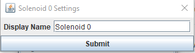
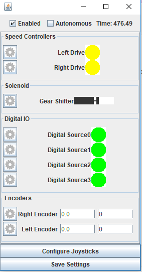

.. _basic-setup:

Configurating the Simulator
===========================

Once you have the added neccessary simulator files to your project, you are ready to
run it and customize it for your teams robot.

If you have installed the simulator on top of a brand new repository, you won't see much
going on and won't have any options to configure. Alternativly, if you are running for the
first time with an already completed robot, you might see a large number of sensors and actuators
that you can set up.

For this portion of the documentation, we will be using the "Example Robot" that comes packaged
with the tool.

Simple Customization
....................
The first time that you run the simulator with the example robot, you should see a screen like this

|image_initial_setup|

You can now change your robots state into autonomous or disabled modes, see the elased "Match Time", 
and configure the componenets settings.

If you select the "Change Settings" button, you will be open to changing the settings 
for all of the loaded components. Simply click on the gear next to the component to see
what options are available. 
 
|image_edit_mode|

Most of the settings are very simplistic; you can only set 
a custom display name for the component. Here is an example of the dialog that allows you to set a new name for a solenoid

|image_edit_solenoid|

There are several options for how you can configure the connected motor settings for a 
speed controller, outlined __here__

|image_edit_speed_controller|

The encoder settings allow you to hook up an encoder to a speed controller as a feedback 
device.  This is very useful for simulating things like your drivetrain/elevator/arm/etc

|image_edit_encoder|

Once you have renamed the components and hooked everything up as you would like, you should 
see something like this.  Not that the encoders now display count and distance rather 
than "Not Hooked Up"

|image_completed_setup|

Once you are all set, you can click the "Save Settings" button to persist the changes to disk, 
and leave edit mode.  Now the next time you start it up, you should see the new names you 
gave the components

I2C and SPI simulators
.......................................
Due to the highly de-coupled nature of SnobotSim, the simulator cannot determine what
sort of device you have connected when you create an I2C or SPI device, so it must be
set up manually. Note, in almost all cases this information must be known on startup,
so after setting up the simulator you must save your changes and restart the simulator.

To configure a I2C or SPI device, click on the ____button___
___insert image_____

Currently the simulator nativly supports the following devices:

-  ADXL345 Accelerometer (Comes with WPILib, either I2C or SPI)
-  ADXL362 Accelerometer (Comes with WPILib, SPI only)
-  ADXRS450 Gyroscope (Comes with WPILib, SPI only)
-  NavX (KauaiLabs simulator, in the I2C or SPI configurations, no USB)

You must find the port you need, and set the appropriate simulator. Note: You are probably setting
up the device with WPILibs enumerations, but if you hover over the constant, IntelliSense will tell
you what internal ID it represents. For example, SPI.kMXP is port ____port____

If you have a custom SPI/I2C device or are using something the simulator doesn't currently support,
you can add your own simulator. This will be discussed later in the documentation

Tank Drive Simulator
....................

SnobotSim provides a very simplistic tank drive simulator, assuming that you are running with
an independant skid steer robot, with a gyro measuring yaw feedback. Note: the current implementation
has very little science behind it, and is mostly used for very rough testing purposes.

__insert image___

.. |image_initial_setup| image:: images/InitialStartup.png
.. |image_edit_mode| image:: images/EnterEditingMode.png

.. |image_edit_speed_controller| image:: images/EditSpeedControllerSettings.png
.. |image_edit_encoder| image:: images/EditEncoderSettings.png
