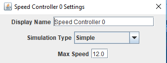
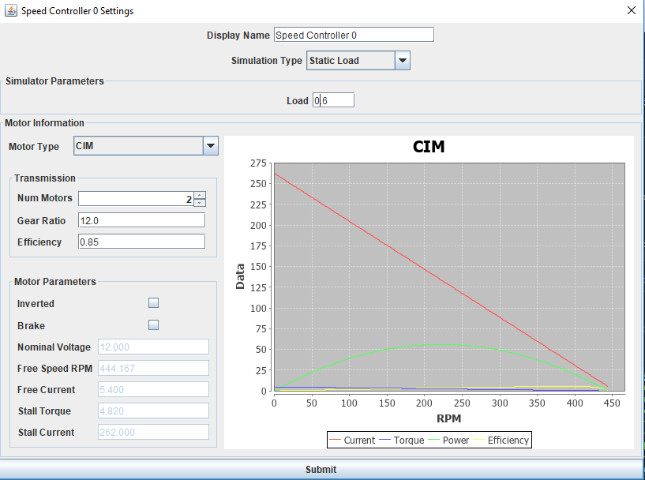
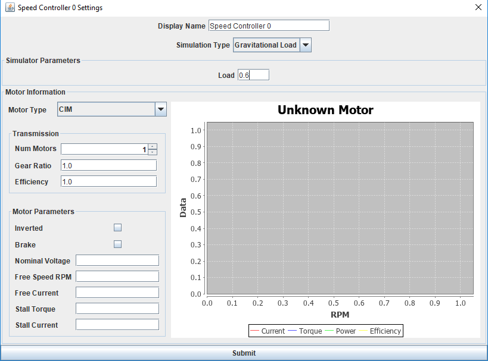
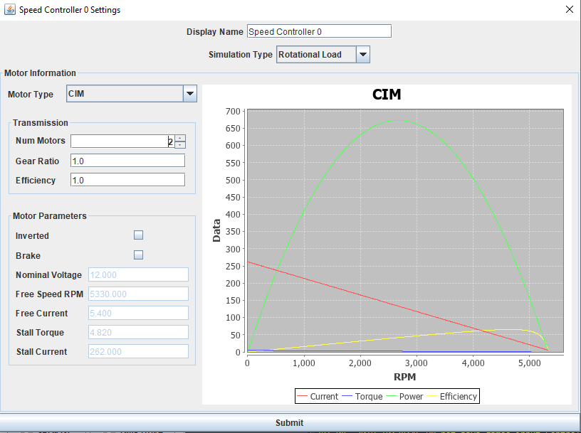

.. _motor-sim-models:

Motor Model Simulations
=======================

There are a handful of pre-canned motor model simulations. They are not intended to be real-world accurate,
but can do a decent enough job to simulate things such as your drivetrain, or an arm that rotates and has to fight gravity.

Linear Simulator
................
This is the simplest simulator type available. It assumes instantaneous acceleration such that 
`motor_speed = (voltage / 12) * MAX_SPEED`, where max speed is a configurable value in the units of your choice

|linear_simulator|

Static Load Simulator
.....................
This motor model simulates a motor with some applied load. It does not account for additional forces like springs or gravity,
and can be used to simulate horizontal linear actuators, or even your drive train motors.

|static_load_simulator|

Gravity Load Simulator
......................
This model simulates something that has to fight gravity in one direction, like an elevator. It is not meant to be used with an
arm where the load applied by gravity varies by the angle of the arm, only constant forces.

|gravitational_load_simulator|

Rotational Load Simulator
.........................
This model simulates and rotating arm, where gravity effects the load through its travel.

Note: THIS IS NOT FULLY SUPPORTED

|rotational_load_simulator|

